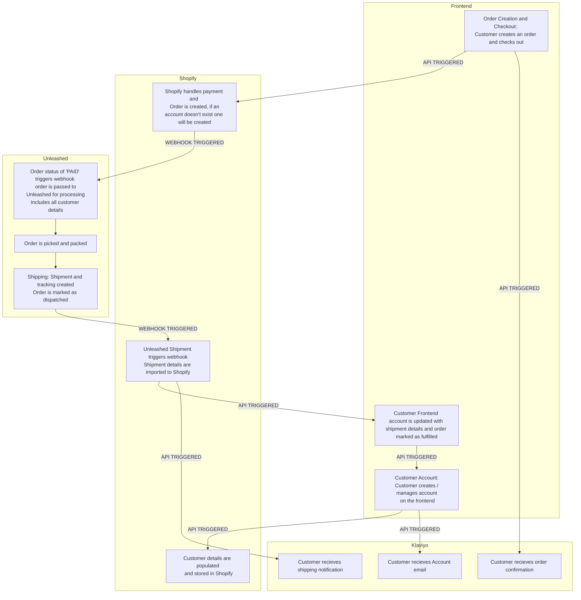

# Thameen London - Headless Shopify storefront

### If at any point you require support with this project, please contact <sami@daze.digital> 

##### NOTE: This is a protected repository and no code can be altered without formal code reviews and pull requests. 

#### Create a Branch
When creating your distributor storefront, please create a branch on this repository with your locale name eg: ```us```

#### Hosting 
Storefronts are hosted on Vercel by Daze DGTL, once your branch is ready to be deployed to production a domain will be created for your locale eg: us.thameenlondon.com, if you require a staging link please get in touch.

#### Local set up & Installation

Once you have created your branch, open the code up in your IDE and run the following command to install dependencies:

```
npm install
```

#### Running locally

To run this project on your local machine, run the following command. The project will be accesssible on your browser at: ```localhost:3000```

```
npm run dev
```

# Shopify Credentials

You will need to add your Shopify Storefront API token and your Shopify store domain to a .env file to pull your Shopify data into your headless frontend, if you need assistance on how to get your Storefront API Token refer to the Shopify docs or contact <sami@daze.digital> for support.

```
PUBLIC_STOREFRONT_API_TOKEN="c6815e5d7f03b9abed1f3d6f8e72045c" // example API token
PUBLIC_STORE_DOMAIN="your-store-domain.myshopify.com"
```

# Integrations

This site uses a number of integrations:

\* **Unleashed** - whilst this isnt used on the frontend, it is used as the main inventory management and logistics system. It uses webhooks to transfer product data between the two platforms. This is an optional choice for distributors but is necessary for Thameen as it automates the order workflow and manages the inventory.

\* **Klaviyo** - We use Klaviyo for tracking customer behaviors: Abandonded Cart, Customer signups, Browse Abandonment, Loyalty etc. The code is integrated directly into the frontend and must be swapped out for your instance of Klaviyo. **Note:** this uses Javascript and server side rendering so experience with JS and React/SSR is needed. If you need assistance contact <sami@daze.digital> for support.

# Webhooks & API
### Using modern web technologies we have automated the order and checkout process, product syncing and content creation.

##### <u>Customer and Order dataflow</u>

The below diagram explains how we use Webhooks and API's to communicate between our 4 platforms to create a scalable e-commerce application that automates checkouts, notifications and fulfillment status.


<br/><br/>
##### <u>Product, Collection & Content: Management and Creation</u>

The below dataflow highlights how products are created in unleashed and imported into Shopify using webhooks. From there all products are managed in Shopify, including creating Collections, Metaobjects to extend the storefront and content such as videos and imagery.

[![](https://mermaid.ink/img/pako:eNqNVmtz2jgU_St3_NmhBVxe0-kMxTRlwgZKoJnZuB9kWWA1RvLKNoRm8t97r2xDsg3ZhRlso_s495wjwaPDdSScgbNO9J7HzOQwXQSK3lkRbgxLYxgO7wJnpRLBslhEgfMjUJE0gudSKxsN-GrezRczfzVawmgxHi7H_uBjaN59mhvJhQtLmSd48UXGjUwp0YXJlm1E5towuBVyE-cu3FytXJgbHRU8hxFCy4AzBaEA8ZBqk4sIuwsVvQT4GQHexDqV68MZeK0jvMV4NJ58r_HBREGVie1ULlRuGyq9p6ZbphAk9bRF2LHKau6fhqwTRSQRIMhjyTovvBvNptPxaDmZXQ-gzDGCYfC7VRrR9QdcXHyCFn8eWBFouciARdEJSHQ39P0JRQ2nMJpdL8fXyzL-Vlj83JaH1FIMW5GztRRJhGVUZB91-BMpymwOfVekiWaI3YoCuaZ-dNGFgSzXRtCDUDFTHG9jAavJa0qMUIkvxvJxzintI4lI4bBEvcqk2sAl1fg2hb2AfwphDqVChC7ROsWuRheb2EJC0hisjd7WVDfgOH45OoPooNhWcsAsfF5rYzPTylyWmkZFaPuMsrUTC6tSBlmMvpAqy5nKkwNoIiMtwkTSzkCATN1nNWs0ghRZ3SH8Q9py6CqMXENZtB1dYoBUfDE210lSUlmq9oWmRyVQmv1_Tn1KLgevUfG3jKSEsB6oatdIqSY5gFe2x-57JIAiI5mlCSNiTsax1XyRoiNoXlyi5J0wGaHR6-P-G84nLhx0YUcXD2QhejQwomNpXSiLnyUyP9QIY7YTUGQiem7xeuZ667i4s4_UWTt9FUZb7f_wr4_-vUrYTh70Gft6r9i3ygCMFXKHFFF7hnmIrvabdew-ljxGtpKEThcLfB8LVRo9N4zfE0W8QOK2SFBNVobnSqWY9z-dytAWCEeKHfbYSYYnbBhrfV8r7z33482zWV5wRWeOZSytj6GyvrWF3QwIT9b2krlWJ1ID1cRDDW7Hn7_OZlewXEwuL8eLsV-edIFqlTesvCP1_xXTrlZer-DhKjuTyOq1M6m0Hp7JDXGNv7EWvlH3mPvGenSmNifGHNdB3bdMRviT_EhKBQ4yvBWBM8DbiJn7wAnUE8axItc3B8WdQW4K4TqlML5k6OStM1izJMNvU6acwaPz4AwuvEb_fbfdazU7Xa_vtXpd1zk4g0670e57vXan2erhZ7_pPbnOL62xRLPxvtXpNL1u70Oz77X7XVvub7tW9qQfPG3-Kv9B2D8ST78Bknm2Hw?type=png)](https://mermaid.live/edit#pako:eNqNVmtz2jgU_St3_NmhBVxe0-kMxTRlwgZKoJnZuB9kWWA1RvLKNoRm8t97r2xDsg3ZhRlso_s495wjwaPDdSScgbNO9J7HzOQwXQSK3lkRbgxLYxgO7wJnpRLBslhEgfMjUJE0gudSKxsN-GrezRczfzVawmgxHi7H_uBjaN59mhvJhQtLmSd48UXGjUwp0YXJlm1E5towuBVyE-cu3FytXJgbHRU8hxFCy4AzBaEA8ZBqk4sIuwsVvQT4GQHexDqV68MZeK0jvMV4NJ58r_HBREGVie1ULlRuGyq9p6ZbphAk9bRF2LHKau6fhqwTRSQRIMhjyTovvBvNptPxaDmZXQ-gzDGCYfC7VRrR9QdcXHyCFn8eWBFouciARdEJSHQ39P0JRQ2nMJpdL8fXyzL-Vlj83JaH1FIMW5GztRRJhGVUZB91-BMpymwOfVekiWaI3YoCuaZ-dNGFgSzXRtCDUDFTHG9jAavJa0qMUIkvxvJxzintI4lI4bBEvcqk2sAl1fg2hb2AfwphDqVChC7ROsWuRheb2EJC0hisjd7WVDfgOH45OoPooNhWcsAsfF5rYzPTylyWmkZFaPuMsrUTC6tSBlmMvpAqy5nKkwNoIiMtwkTSzkCATN1nNWs0ghRZ3SH8Q9py6CqMXENZtB1dYoBUfDE210lSUlmq9oWmRyVQmv1_Tn1KLgevUfG3jKSEsB6oatdIqSY5gFe2x-57JIAiI5mlCSNiTsax1XyRoiNoXlyi5J0wGaHR6-P-G84nLhx0YUcXD2QhejQwomNpXSiLnyUyP9QIY7YTUGQiem7xeuZ667i4s4_UWTt9FUZb7f_wr4_-vUrYTh70Gft6r9i3ygCMFXKHFFF7hnmIrvabdew-ljxGtpKEThcLfB8LVRo9N4zfE0W8QOK2SFBNVobnSqWY9z-dytAWCEeKHfbYSYYnbBhrfV8r7z33482zWV5wRWeOZSytj6GyvrWF3QwIT9b2krlWJ1ID1cRDDW7Hn7_OZlewXEwuL8eLsV-edIFqlTesvCP1_xXTrlZer-DhKjuTyOq1M6m0Hp7JDXGNv7EWvlH3mPvGenSmNifGHNdB3bdMRviT_EhKBQ4yvBWBM8DbiJn7wAnUE8axItc3B8WdQW4K4TqlML5k6OStM1izJMNvU6acwaPz4AwuvEb_fbfdazU7Xa_vtXpd1zk4g0670e57vXan2erhZ7_pPbnOL62xRLPxvtXpNL1u70Oz77X7XVvub7tW9qQfPG3-Kv9B2D8ST78Bknm2Hw)

<br/> <br/>
# To point your Shopify theme to your headless URL

This repository contains an altered ```theme.liquid``` file that we use to point our Shopify instance to our headless storefront.

Edit ```theme.liquid``` and enter your live url into ```loc.host``` this can be used during development to show your dev site as well.

**REMEMBER:** Change this url to your live url once your store is ready to go live.

```
loc.host = '[your-live-url-here]'
```

# Documentation & Resources

We are currently developing a support site for all documentation surrounding the platform we have created for Thameen London and other clients on our Jamstackr plans.

This will be available in the coming months, if you need help contact <sami@daze.digital>

This will include tutorials and training covering:

<ul>
  <li>
    Shopify setup
    <ul>
      <li>
        Accessing your Storefront API
      </li>
      <li>
        Integrating 3rd party apps
      </li>
      <li>
        Adding theme files for a headless storefront
      </li>
      <li>
        Product and Collections
      </li>
      <li>
        Extending your storefront using metafields
      </li>
    </ul>
  </li>
  <li>
    Setting up the project and code
    <ul>
      <li>
        Overview on dependencies
      </li>
      <li>
        Theming with Tailwind and Sass
      </li>
      <li>
        Client vs Server components and how to use them
      </li>
      <li>
        Brief overview on Shopify & Custom components and Hooks
      </li>
    </ul>
  </li>
  <li>
    Data Handling
    <ul>
      <li>
        Getting GraphQL setup
      </li>
      <li>
        How to query data within the code and display your Products
      </li>
      <li>
        Keeping your environment variable secure using api routes
      </li>
    </ul>
  </li>
  <li>
    Unleashed
    <ul>
      <li>
        How we use webhooks to power automation
      </li>
      <li>
        Best Practices: Using Unleashed correctly when integrating with Shopify
      </li>
    </ul>
  </li>
  <li>
    Klaviyo
    <ul>
      <li>
        How to set up tracking on a headless storefront
      </li>
      <li>
        How to add popups and modals on a headless storefront using Hooks
      </li>
      <li>
        Email template creation to match branding including custom fonts
      </li>
    </ul>
  </li>
</ul>
